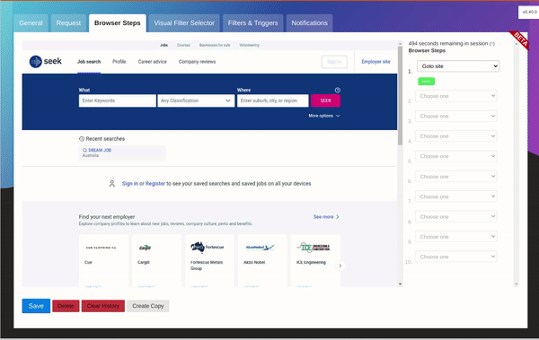
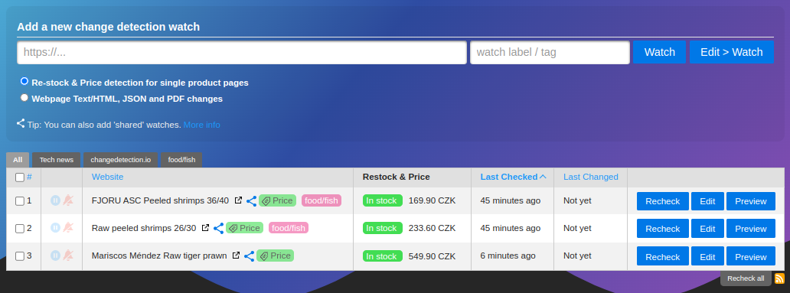
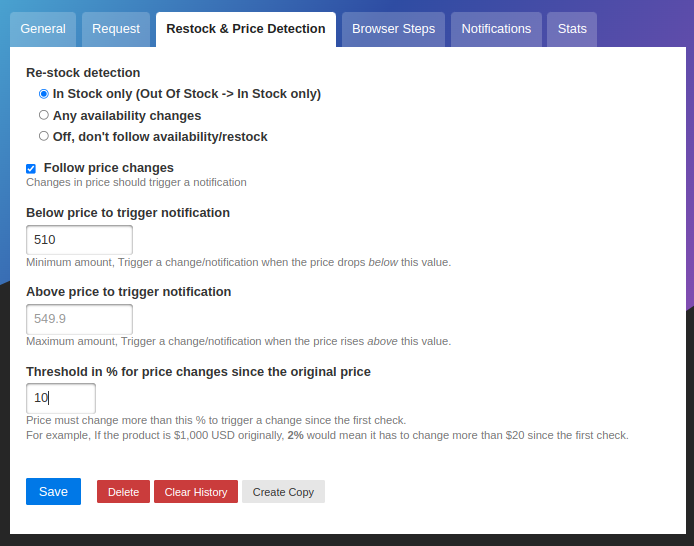

### Perform interactive browser steps

Fill in text boxes, click buttons and more, setup your changedetection scenario. 

Using the **Browser Steps** configuration, add basic steps before performing change detection, such as logging into websites, adding a product to a cart, accept cookie logins, entering dates and refining searches.

[]
After **Browser Steps** have been run, then visit the **Visual Selector** tab to refine the content you're interested in.
Requires Playwright to be enabled.

### Awesome restock and price change notifications

Enable the _"Re-stock & Price detection for single product pages"_ option to activate the best way to monitor product pricing, this will extract any meta-data in the HTML page and give you many options to follow the pricing of the product.

Easily organise and monitor prices for products from the dashboard, get alerts and notifications when the price of a product changes or comes back in stock again!

[]Set price change notification parameters, upper and lower price, price change percentage and more.
Always know when a product for sale drops in price.

[]

### Example use cases

- Products and services have a change in pricing
- _Out of stock notification_ and _Back In stock notification_
- Monitor and track PDF file changes, know when a PDF file has text changes.
- Governmental department updates (changes are often only on their websites)
- New software releases, security advisories when you're not on their mailing list.
- Festivals with changes
- Discogs restock alerts and monitoring
- Realestate listing changes
- Know when your favourite whiskey is on sale, or other special deals are announced before anyone else
- COVID related news from government websites
- University/organisation news from their website
- Detect and monitor changes in JSON API responses 
- JSON API monitoring and alerting
- Changes in legal and other documents
- Trigger API calls via notifications when text appears on a website
- Glue together APIs using the JSON filter and JSON notifications
- Create RSS feeds based on changes in web content
- Monitor HTML source code for unexpected changes, strengthen your PCI compliance
- You have a very sensitive list of URLs to watch and you do _not_ want to use the paid alternatives. (Remember, _you_ are the product)
- Get notified when certain keywords appear in Twitter search results
- Proactively search for jobs, get notified when companies update their careers page, search job portals for keywords.
- Get alerts when new job positions are open on Bamboo HR and other job platforms
- Website defacement monitoring
- Pokémon Card Restock Tracker / Pokémon TCG Tracker
- RegTech - stay ahead of regulatory changes, regulatory compliance

_Need an actual Chrome runner with Javascript support? We support fetching via WebDriver and Playwright!</a>_

#### Key Features

- Lots of trigger filters, such as "Trigger on text", "Remove text by selector", "Ignore text", "Extract text", also using regular-expressions!
- Target elements with xPath(1.0) and CSS Selectors, Easily monitor complex JSON with JSONPath or jq
- Switch between fast non-JS and Chrome JS based "fetchers"
- Track changes in PDF files (Monitor text changed in the PDF, Also monitor PDF filesize and checksums)
- Easily specify how often a site should be checked
- Execute JS before extracting text (Good for logging in, see examples in the UI!)
- Override Request Headers, Specify `POST` or `GET` and other methods
- Use the "Visual Selector" to help target specific elements
- Send a screenshot with the notification when a change is detected in the web page
